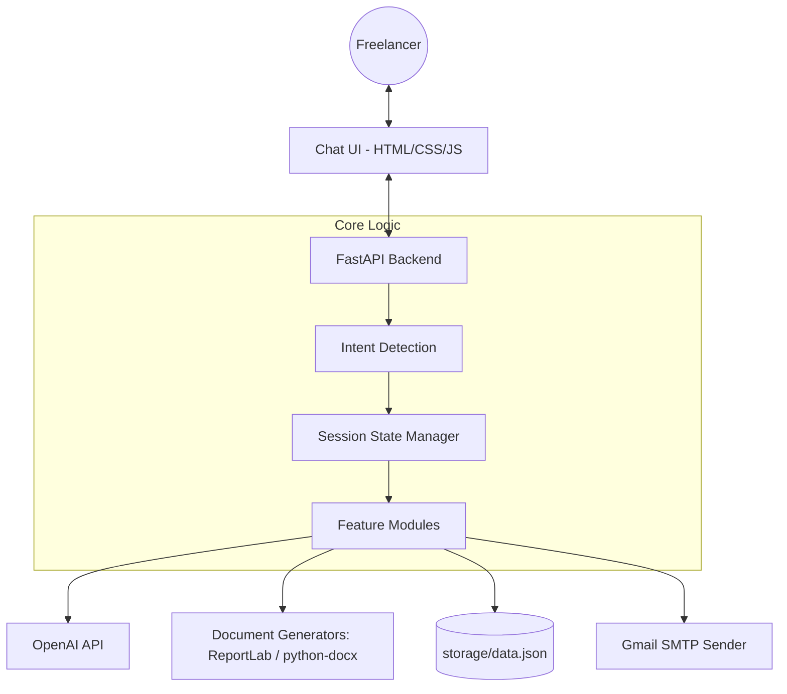

# LUME: Freelancer Admin Automation Chatbot - Design Document

**Date:** 2026-03-06
**Status:** Approved
**Brain:** OpenAI (GPT-4o)
**Backend:** FastAPI
**Storage:** JSON-based persistent store

---

## 1. Goal Description
LUME is an AI-powered personal administrative assistant for freelancers, designed to automate the creation of proposals, invoices, and payment reminders. It uses a conversational interface to gather requirements and generate professional documents, saving freelancers significant unpaid administrative time.

---

## 2. Architecture Overview

### Component Diagram


### Key Decisions
- **FastAPI:** Chosen for its high performance, async support, and automatic documentation.
- **OpenAI:** Serves as the primary intelligence for intent detection and content generation.
- **JSON Storage:** A client-centric JSON file (`storage/data.json`) will be used for simplicity. Each client will be assigned an **Incremental ClientID** (e.g., `CLT-1001`) which will serve as the **Primary Key**.
- **Multi-Turn Interaction:** The bot uses a persistent session state to collect missing fields conversationally rather than requiring a static form.

---

## 3. Data Model (JSON Schema)
The store is organized by **ClientID (Primary Key)** to ensure every client is uniquely identifiable, even if they share the same name (differentiated by email at creation).

```json
{
  "last_invoice_number": 1000,
  "last_client_id": 1000,
  "clients": {
    "CLT-1001": {
      "id": "CLT-1001",
      "name": "Full Name",
      "email": "client@email.com",
      "company": "Company Name",
      "phone": "+91 XXXXX XXXXX",
      "gstin": "27AAACR1234A1Z1",
      "address": {
        "city": "Pune",
        "country": "India"
      },
      "created_at": "2026-03-06T10:00:00",
      "projects": [],
      "proposals": [],
      "invoices": [
        {
          "invoice_number": "INV-1001",
          "grand_total": 1000,
          "total_paid": 400,
          "total_pending": 600,
          "payments": [
            {"amount": 400, "date": "2026-03-05", "method": "Bank Transfer"}
          ],
          "status": "PARTIAL"
        }
      ]
    }
  }
}
```

---

## 4. Interaction Flow

### Intent Detection & Extraction
1. **Initial Input:** User sends a message.
2. **Intent & Extract:** System calls OpenAI to:
    - Identify the intent (PROPOSAL, INVOICE, REMINDER, QUERY).
    - Extract any fields provided in the initial message (e.g., Client name, Budget).
3. **Field Collection:** If required fields are missing, the bot asks for them one by one.
4. **Processing:** Once all fields are present, the module-specific logic executes.

### Feature Modules
- **Proposal Generation:** Creates Introduction, Project Understanding, Approach, Deliverables, Timeline, Pricing, Terms, and Closing. Generates both PDF and .docx.
    - **New:** Automatically creates a new client record if the client name is not found in the database.
    - **Conversational Editing:** After a proposal is generated, the user can provide natural language instructions (e.g., *"Make the intro more excited"* or *"Add a 20% upfront payment term"*). The bot uses the LLM to update the draft and regenerates the `.docx` and `PDF` files immediately.
- **Invoice Generation:** Calculates subtotal, tax, and total. Auto-increments invoice numbers. Generates PDF. **New:** Manages part-payments (paid/pending) and creates client records for new clients.
- **Payment Reminders:** Detects overdue duration (Gentle/Firm/Urgent) and drafts an email. Sends via Gmail upon confirmation. Automatically updates with the current pending balance.

---

## 5. Security & Persistence
- **App Passwords:** Gmail connection uses App Passwords stored in `.env`.
- **API Keys:** OpenAI key stored in `.env`.
- **Validation:** Generated proposals must meet a minimum word count and contain all 8 sections.
- **Atomic Writes:** The system will ensure data is saved to disk after every update to prevent losses.

---

## 6. Verification Plan

### Automated
- **Unit Tests:** For calculations (invoice math), intent detection (mocked prompts), and storage helpers.
- **Schema Validation:** Ensure `data.json` matches the intended structure.

### Manual
- **Chat Flow:** Test multi-turn collection of fields.
- **Document Preview:** Verify PDF/Word formatting.
- **Email Delivery:** Send a test reminder to a verified address.
